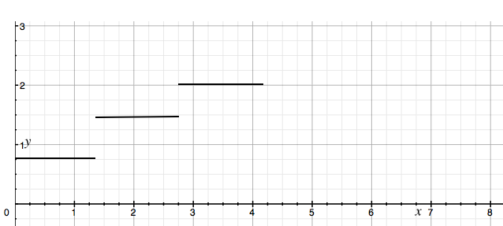
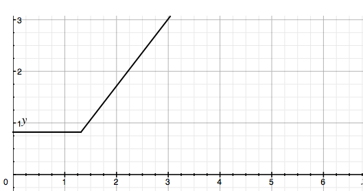

[TOC]

## 需求描述
AS&ISA支持前台导出文件支持密码保护的zip压缩文件方式导出(迭代2)  
需求规格：  
1、前台导出全部为zip的格式，且带有密码保护。密码在用户导出的时候由用户来设置。  
2、该特性支持配置开关。默认为不开启。配置开关在universe级别配置，对所有的组件生效。  
ISA报表：  
1、 在报表、仪表盘、多维分析的导出支持该特性。【报表、仪表盘、营销指标评估、自助分析、数据录入、自助分析涉及下载的需要做】  
2、 通过将原来导出的文件压缩为zip，然后提供用户导出。  
导出资源和元数据等配置信息不需要支持。  
Dfx设计：   
压缩对cpu、内存都有消耗，采用队列的方式管理压缩任务，实现压缩任务对其他访问的性能压力可控。  

--------------------

## 需求备忘 （20170510）

### 压缩文件加密需求进展
|      场景           | 文件格式 | 后台压缩逻辑+密码校验 | 前台开关 | 前台校验及ui优化 | 前台密码传递 | 验证是否成功 |
| ----               | -------| ----------------   |  ------ |------ |------ |------ |
| 导出-报表            |  zip | √                   | √       |√        |√       |√       |
| 导出-报表            |  非zip | √                   | √       |√        |√       |√       |
| 导出-报表（有参数面板）|  zip | √                   |√      |√        |√       |√       |
| 导出-报表（有参数面板）|  非zip | √                   |√      |√        |√       |√       |
| 导出-数据录入         |  所有 | √                   |√      |√      |√      |√      |
| 导出-仪表盘          |  所有  | √                   |√       |√       |√       |√       |
| 导出-自助分析        |  所有  | √                   |√       |√       |√       |√       |
| 导出-自助分析（下钻） |  所有  | √                   |√       |√       |√       |√       |
| 导出-报表-离线下载    | 离线任务的报表是否加密，与报表导出时状态保持一致|-       |-       |-       |-       |-       |
| 导出-报表-离线下载(发送邮件)| 离线任务的报表是否加密，与报表导出时状态保持一致-       |-       |-       |-       |-       |-       |
| 导出-报表-发布订阅    | 所有   | √                   |
| 导出-营销指标评估    | 所有   | √                   |

### dfx测试

### 问题记录
1. [x] 中文乱码
1. [x] 文件名过长
1. [x] 前台校验错误提示样式
1. [x] 压缩文件时，极小概率报“压缩文件已存在异常”  

--------------------

##### 关于密码从前台传递到后台，是否需要加密的备忘
    疑问：通过 burpsuite 等拦截用户输入的密码，生成的压缩文件密码非用户输入密码，这样算不算是被篡改，算不算有安全问题？
    答：不算篡改，非安全问题。在 https 的环境（且证书有效）里，本身已对数据进行非对称和对称加密，也无加密该传输数据的必要。
    疑问：那在非 https 环境下，算不算安全问题？压缩文件是否也会被非法用户获取呢？
    答：非 https 本身就是安全问题。其次在 http 环境下所有场景都危险，危险的不止是这个密码传递场景。而且就算加密，如果是密文传到后台，后台也需要增加解密逻辑。
        如果改了密文，也相当于改了密码。数据无论加密不加密，对后台来说都是明文，所以从此逻辑上看也是无必要加密的。
        除非根据 https 的原理，手动模拟实现，对密码和对密码加密的密码加密，再搞一个第三方作证书，这样倒不如检查下 https 证书为什么失效。
    结论：无必要加密传输密码

##### 关于离线下载什么时候加密的问题
    场景：离线下载的边界分为两部分：直接下载和邮件发送。
    isa 原来的逻辑是生成报表文件后，将该文件的二进制存到数据库，并且发送该二进制到邮箱。
    问题：试想一下用户的使用场景，用户点击报表，导出，提示输入密码，点击离线报表。进入离线报表监控页面，发现报表渲染完成。
    1. 此时会发送邮件：由于此操作用户不可选择时机，所以视为紧接着“报表导出”的行为，所以此处：通过邮件发送的文件应该是加密的，且密码和用户输入的密码相同。
    2. 用户通过点击离线报表监控页面的文件链接，此时文件也应该是加密的，且密码和用户输入的密码相同。
    如果以上第二种情况，要弹窗让用户输入密码，用户会觉得奇怪，我不是已经输入密码了吗？
    但此时有一个问题：之前的离线报表，或运行的时候加密开关未打开的报表，是没有密码的。此时可以通过加入一个开关“在导出需要加密的情况下，离线报表下载无论如何也要重新加密”
    经过与 SE 讨论，确认采用“离线监控页面不做弹框，报表水印、加密状态与报表运行界面的状态保持一致”。

##### 关于发布订阅的问题
    大致想了一下，发布订阅每次会重新渲染报表，所以发布订阅的 vo 可能需要增加一个密码的字段，或者新建一个数据库表。

## DFX 测试
    结果出来了，报告等下再贴。先贴下结论： 根据不同的环境，不同的 cpu 核心数 cores_num 和 可能的并发数 max_users，动态设置线程池大小 poolSize 三个参数都可设置，逻辑如下图：

策略见下图：

## 压缩加密需求 DFx 设计结论依据或测试报告

压缩、加密（尤其是文件大小较小的场景）是典型的 cpu 密集型任务，经测试，单线程加密压缩一个 80MB 的文件，cpu 的单个核心会达到 95% 左右的使用率（始终未出现 100% 的情况），而 io 使用率仅有小幅波动。  
目前 报表系统允许的最高并发访问量并没有一个明确的数据，实际上用户集中一个时间导出数据量较大的报表的情况也很难出现。但是为了避免在此种情况出现的时候，系统 cpu 资源被长时间占满导致其它服务不可用，加密压缩的逻辑需要进行队列化的处理。

### 技术选型

* 生产队列 Queue + 多线程消费者 互相独立的方案

   这是首先浮现在楼主脑袋里的方案。系统将压缩任务提交给一个统一的 Queue ，由另一个消费逻辑负责根据系统资源情况，多线程处理队列，如下图所示： 
    

   
   这种方案适合队列长度较长的场景，且后期如果有需要将任务分发到各个集群进行处理，也不是很有难度。缺点是实现逻辑较为复杂，针对本需求来说，有点杀鸡用牛刀的感觉。
   
* 线程池扮演队列和消费者 统一的方案
   
   压缩加密本身就是 cpu 密集的任务，进行处理任务的线程本身即可视为一个队列中的元素，而线程池本身也可以做到队列排队、丢弃等队列的功能，因此这种方案是合理的。
   
   目前 java 中处理并发任务的方案，主要有线程池、fork/join框架以及并行流。fork/join 框架较难契合本需求的需要，原因是较难将一个压缩任务分割成小任务分发，且考虑到报表的文件大小一般都是 GB 以下，因此也无必要做这种选择。并行流同样是存在难以拆分任务的问题，所以最终选择的是线程池。
   
* 使用哪种线程池？
    一般我们使用线程池，主要是 `Executors.newFixedThreadPool()` `Executors.newCachedThreadPool()` `Executors.newFixedThreadPool()` 这三种，到底用哪个，是下文主要要验证和说明的问题。

### 线程池种类和线程池大小的确定
   newCachedThreadPool() 无限制最大线程数的功能，是为大量频繁快速消亡的任务设计的线程池。由于加密压缩会瞬间达到较高 cpu 使用率，因此此种线程池无法满足需求。
   newSingleThreadPool() 单线程线程池，能确保按照序列的方式处理任务。
   newFixedThreadPool(int size) 可以指定线程池大小，可以配置等待策略。
   下面针对后面两种线程池进行测试。
   
--------------------
#### 测试方法、工具

本测试是针对新增的一部分具有独立功能的代码进行 loadTest 测试，因此不需要在环境上进行导出、压缩的全流程测试，仅需要针对该部分逻辑进行单元性能测试即可。

##### 环境和工具
suse 8核, Intellij Idea 2017.1, junitperf 1.9.1, junit 4, nmon, 以及一些 linux 常用命令

##### 测试变量

1. 压缩加密开关 zs
1. 线程池  pool
1. 消费线程数量 users
1. 文件常量 src 72.1MB pdf
1. 测试重复次数 iter
1. 时间单位 纳秒

##### 测试过程
ZipUtils
1. 加密与不加密情况下，在性能上的对比

SmartZipper
1. 在使用单线程池(newSingleThreadPool())的情况下，tn 数量变化，在性能上的对比（poolCapacity=1 ）
1. 在消费线程数量稍大，且固定的情况下，增加线程池容量，在性能上的对比（tn稍大的数量需要确定）
1. 在压缩固定大小的文件情况下，增加 poolCapacity 和 tn ，测试系统能承受的最大数量

##### 测试结果（请直接拉到底看结论）
数据参考 压缩加密需求与性能测试备忘——数据.md

### 结论
1. 压缩 72.1 MB 的 pdf 耗时平均 3s 左右，加密压缩耗时x 5.5s 左右，该指标以下称 基准时间。
2. 单线程的情况下，后提交请求的用户必须等待先提交的用户任务完成后，自己的任务才会被处理。第 n 个用户需要等待的时间为 nx.  
  
3. 探讨：核心数固定，线程数 poolSize 固定，时间 t 和用户数 users 是一个分段函数的关系:
   当 users 在队列中的位置 n 小于 线程数，该请求完成的时间为 基准时间 x.
   当 users 在队列中的位置 n 大于 线程数，该请求完成的时间为 (n//poolSize + 1)x. 最长等待时间 (users//poolSize + 1)x.  
  
4. 确定：核心数固定，最大用户数固定，poolSize 的取值取决于两种策略：  
   a. concurrency  
       这种策略的意思是，所有人的任务都一起处理。poolSize >= users,且一般大于核心数。 当闲时用户少于系统核心数，时间为基准时间；大于系统核心数的时候，时间为 (users//cores + 1)x。简而言之，要慢都慢；  
  
   b. fifo  
       这种策略的意思是，排队，让一部分人先回家吃饭。图例参考3
       
       
 目前代码里默认是 fifo 的策略，同时保留了配置该策略的能力（当然要重启），因为楼主是站在用报表的人不多的角度考虑，同时楼主又是个开明的人。关于代码中的计算逻辑，如有疑问，请参考另一篇我还没有写的文章。
   
