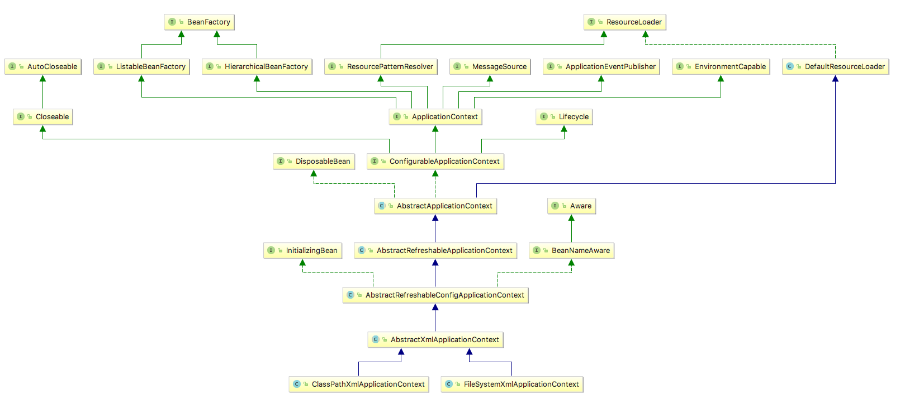
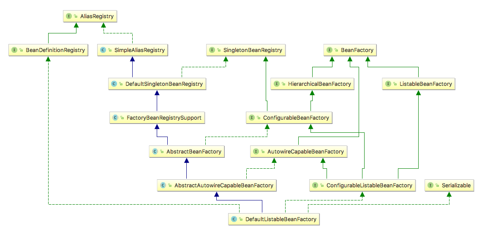
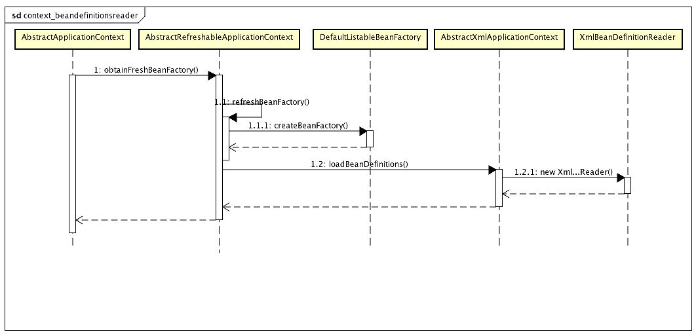
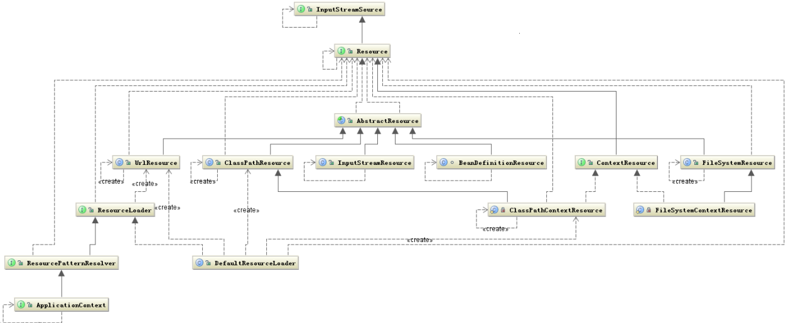
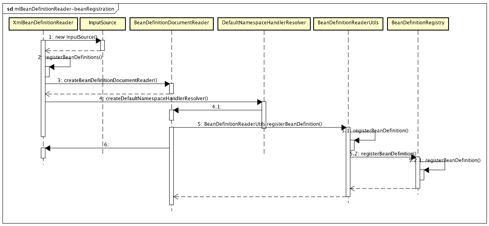

[TOC]

写在前面
=======
__如果你善待你的作品，你也会被生活所善待。__

本文是 【开源项目原理与源码分析】系列文章的第一篇。

作者一直给自己的定位是一个编程爱好者，而不是程序员或者极客。编程爱好者喜欢写些能解决问题的小程序，做点能让媳妇玩的开心的小游戏，帮创业的朋友写写手机客户端和公司网站，没事情做的时候就爱去研究算法题，却从没想过研究开源项目的源码，我认为那是无趣的人做的无聊的事情，除了他们找工作的时候能吹嘘一番，屁用没有。

转折点是半年前的一个项目，一个不是很复杂的需求，考虑到后期扩展性和方便编程的因素，楼主模仿 tomcat 的责任链模式搭了一个框架，主要逻辑是通过搜寻自定义注解注释的类，拿到项目中注册的 worker ，设置前后执行关系，分配到链中调用统一接口方法执行业务逻辑。拿给要一起做需求的同学们一看，大家普遍反应“有点明白，但是总体看的一头雾水”，最后当然我只能放弃这个尝试。

公司项目的一个特点就是多人协作、模块分工，但是每个人信奉的哲学以及编程风格却不一样。有些人喜欢能够实现目的就好，对设计模式不屑一顾，有些人对代码质量、可扩展性与维护性有一定要求，如果没有一个能够确定实施的方案，最后的结果就是效率低下与随处可见的烂代码。读一读古斯塔夫·勒庞的《乌合之众》，《人月神话》以及帕金森琐碎定律，就知道即使是这帮世界上最聪明的人凑在一起，事情也有可能以失败收场。

很多人都相信自己支持这样一个原则，即用最简单、最符合思维逻辑的代码实现功能。可是随着项目规模的增大，无数坚守这一规则的程序员都纷纷缴械投降；究其原因，无非两点：面对高楼大厦，不会设计，或过度设计。为了避免自己和身边还希望改善这一局面的程序员们走上这条不归路，作者下定决心用一年左右的时间，通过深入剖析部分著名开源项目的源码，学习并应用各种设计模式，希望通过这种方式能够让良好的设计理念得以传播。

本文尝试通过调试一个基于 xml 配置的、简单的 Spring 基本 java 工程，了解、学习 Spring 框架的设计理念与模式，为以后程序设计提供一些思路。

原料
===

1. [Spring Framework Reference Documentation](http://docs.spring.io/spring/docs/current/spring-framework-reference/htmlsingle/)
2. 一个简单的 spring 项目
3. 一个	你用的惯的 IDE
4. maven

从简单开始
=========

用过 Spring 的开发人员大概都有这样一个认识，即 Spring 的核心就是 Bean, 可以说 Spring 就是面向 Bean 的编程. 我们传统的使用构造函数、工厂方法等创建实例的过程，
简单说就是 new 出对象，使用该对象的 getter 和 setter 方法设置其需要的其他数据或对象（依赖），该过程由这个对象本身控制。Spring 创建 Bean 的过程与其相反，对象只
需要定义好它需要的依赖，Spring 在创建实例的时候注入这些依赖（即 dependency injection），整个控制权交由 Spring 管理，即所谓的控制反转（Inversion of Control）。
Spring 创建实例之后，就把它放到一个容器中，容器就像一个舞台，而 Bean 就是舞台上的演员，简单吧。

概念交代完，我们来看看 Spring 是如何做到这一点的。相信每个学习 Spring 的开发者都是从下面这个小程序出发的。

```java
package edu.zhaoyu.pojo;

/**
 * Created by flower on 2017/6/10.
 */
public class Person {

    private String name;
    private int age;

    public int getAge() {
        return age;
    }

    public void setAge(int age) {
        this.age = age;
    }

    public String getName() {
        return name;
    }

    public void setName(String name) {
        this.name = name;
    }
}

```

```xml
<?xml version="1.0" encoding="UTF-8"?>
<beans xmlns="http://www.springframework.org/schema/beans"
       xmlns:xsi="http://www.w3.org/2001/XMLSchema-instance"
       xsi:schemaLocation="http://www.springframework.org/schema/beans http://www.springframework.org/schema/beans/spring-beans.xsd">

    <bean id="zhaoyu" class="edu.zhaoyu.pojo.Person">
        <property name="age" value="26" />
        <property name="name" value="zhaoyu" />
    </bean>
</beans>
```

```xml
<project xmlns="http://maven.apache.org/POM/4.0.0" xmlns:xsi="http://www.w3.org/2001/XMLSchema-instance"
         xsi:schemaLocation="http://maven.apache.org/POM/4.0.0 http://maven.apache.org/maven-v4_0_0.xsd">
    <modelVersion>4.0.0</modelVersion>
    <groupId>edu.zhaoyu</groupId>
    <artifactId>spring-source-code</artifactId>
    <version>1.0-SNAPSHOT</version>
    <packaging>jar</packaging>

    <dependencyManagement>
        <dependencies>
            <dependency>
                <groupId>org.springframework</groupId>
                <artifactId>spring-framework-bom</artifactId>
                <version>4.3.9.RELEASE</version>
                <type>pom</type>
                <scope>import</scope>
            </dependency>
        </dependencies>
    </dependencyManagement>


    <dependencies>
        <dependency>
            <groupId>org.springframework</groupId>
            <artifactId>spring-context</artifactId>
        </dependency>

        <dependency>
            <groupId>org.apache.logging.log4j</groupId>
            <artifactId>log4j-core</artifactId>
            <version>2.6.2</version>
        </dependency>
        <dependency>
            <groupId>org.apache.logging.log4j</groupId>
            <artifactId>log4j-jcl</artifactId>
            <version>2.6.2</version>
        </dependency>
    </dependencies>
    <build>
        <plugins>
            <plugin>
                <groupId>org.apache.maven.plugins</groupId>
                <artifactId>maven-compiler-plugin</artifactId>
                <configuration>
                    <source>1.8</source>
                    <target>1.8</target>
                </configuration>
            </plugin>
        </plugins>
        <finalName>${groupId}-${artifactId}-${version}</finalName>
    </build>
</project>

```

```java
package edu.zhaoyu.springsource;

import edu.zhaoyu.pojo.Person;
import org.springframework.context.ApplicationContext;
import org.springframework.context.support.ClassPathXmlApplicationContext;

/**
 * a simple application demo used for debugging spring ioc
 * 这个场景从 xml 中初始化一个 Spring IoC 容器，该 xml 中配置了一个 id 为 "zhaoyu" 的 Person 对象。简直太简单了
 * 虽然在开发中我们很少会配置一个 pojo，这一般是 service 和 dao 干的事情，但是不要纠结，这不妨碍我们理解 Spring 的原理。
 * Created by flower on 2017/6/10.
 */
public class Client {
    public static void main(String[] args) {
        ApplicationContext applicationContext = new ClassPathXmlApplicationContext("beans.spring.xml");
        Person person = applicationContext.getBean("zhaoyu", Person.class);
        System.out.println(person.getName());
    }
}
```

下面的章节就从这个简单的程序出发，一点点揭开 Spring 的神秘面纱。

调试
===

`ApplicationContext applicationContext = new ClassPathXmlApplicationContext("beans.spring.xml");`

<div style="width:80%">
ApplicationContext 就是上面提到的 IoC 容器，负责初始化、配置、组装 Bean。它通过读取配置信息来确定要初始化的 Bean 以及怎么初始化。配置信息可以是 xml，Java 注解，以及 Java 代码。本例用的就是 xml 的方式。Spring 为我们定义好了一些开箱即用的 ApplicationContext 实现类.这个 ClassPathXmlApplicationContext 就是其中一种，顾名思义，这个类是从 classpath 下面搜寻 xml 以获取配置信息。查看源码 ClassPathXmlApplicationContext 最终__继承 DefaultResourceLoader__，并实现了ApplicationContext 的 一个子接口 ConfigurableApplicationContext。类似的实现还有 FileSystemXmlAplicationContext。正如下图所示：
</div>



一目了然，该图的右半部分保证了这些容器能够从任意位置获取配置文件，而左半部分便是 Spring Ioc 容器的核心结构。该图出现的 BeanFactory，就是本文的重点。

### BeanFactory
还是从代码说起，看看 ClassPathXmlApplicationContext 是怎么和 BeanFactory 发生关系的。查看 ClassPathXmlApplicationContext 的最终调用的构造函数，发现其最终调用了其父类 AbstractApplicationContext 的 refresh() 方法，这个方法的代码如下：
```java
	@Override
	public void refresh() throws BeansException, IllegalStateException {
		synchronized (this.startupShutdownMonitor) {
			// Prepare this context for refreshing.
			prepareRefresh();

			// Tell the subclass to refresh the internal bean factory.
			ConfigurableListableBeanFactory beanFactory = obtainFreshBeanFactory();// 1-0

			// Prepare the bean factory for use in this context.
			prepareBeanFactory(beanFactory);

			try {
				// Allows post-processing of the bean factory in context subclasses.
				postProcessBeanFactory(beanFactory);

				// Invoke factory processors registered as beans in the context.
				invokeBeanFactoryPostProcessors(beanFactory);

				// Register bean processors that intercept bean creation.
				registerBeanPostProcessors(beanFactory);

				// Initialize message source for this context.
				initMessageSource();

				// Initialize event multicaster for this context.
				initApplicationEventMulticaster();

				// Initialize other special beans in specific context subclasses.
				onRefresh();

				// Check for listener beans and register them.
				registerListeners();

				// Instantiate all remaining (non-lazy-init) singletons.
				finishBeanFactoryInitialization(beanFactory);

				// Last step: publish corresponding event.
				finishRefresh();
			}

			catch (BeansException ex) {
				if (logger.isWarnEnabled()) {
					logger.warn("Exception encountered during context initialization - " +
							"cancelling refresh attempt: " + ex);
				}

				// Destroy already created singletons to avoid dangling resources.
				destroyBeans();

				// Reset 'active' flag.
				cancelRefresh(ex);

				// Propagate exception to caller.
				throw ex;
			}

			finally {
				// Reset common introspection caches in Spring's core, since we
				// might not ever need metadata for singleton beans anymore...
				resetCommonCaches();
			}
		}
	}
```
我们化繁为简，只关注有助于我们快速理解原理的代码行。首先看注释 //1-0 标注的这一行代码 `ConfigurableListableBeanFactory beanFactory = obtainFreshBeanFactory();`。如果把 IoC 容器比作一个舞蹈学校，那么舞蹈学校需要一个舞蹈老师， beanFactory 就是这个老师，老师负责教出舞蹈演员，演员就是我们的 Bean。来看看这个 obtainFreshBeanFactory() 是怎么获取这个“新鲜的 Bean 工厂”的吧。

```java
	protected ConfigurableListableBeanFactory obtainFreshBeanFactory() {
		refreshBeanFactory();// 主要逻辑 1-1
		ConfigurableListableBeanFactory beanFactory = getBeanFactory(); // 一个简单的带有锁的 getter，主要逻辑在上一行代码
		if (logger.isDebugEnabled()) {
			logger.debug("Bean factory for " + getDisplayName() + ": " + beanFactory);
		}
		return beanFactory;
	}
```

这是 // 1-1 refreshBeanFactory() 的代码。

```java
	@Override
	protected final void refreshBeanFactory() throws BeansException {
		if (hasBeanFactory()) {// 如果容器内已经存在 bean工厂，
			destroyBeans();
			closeBeanFactory();
		}
		try {
			DefaultListableBeanFactory beanFactory = createBeanFactory();// 1-2
			beanFactory.setSerializationId(getId());
			customizeBeanFactory(beanFactory);
			loadBeanDefinitions(beanFactory);// 1-4
			synchronized (this.beanFactoryMonitor) {
				this.beanFactory = beanFactory;
			}
		}
		catch (IOException ex) {
			throw new ApplicationContextException("I/O error parsing bean definition source for " + getDisplayName(), ex);
		}
	}
```

//1-2 处 createBeanFactory() 的最终返回类型是一个 DefaultListableBeanFactory ，该类就是 BeanFactory 的最终默认实现类，该类实现了 BeanFactory 的所有子接口 ListableBeanFactory、HierarchicalBeanFactory 和 AutowireCapableBeanFactory。为什么要定义这么多接口呢？每个接口都有各自的使用场景，起到限制和区分数据访问的作用，如果感兴趣，读者日后可以自己查阅各个接口的调用处研究，本文不再赘述。createBeanFactory()的代码如下：

```java
	protected DefaultListableBeanFactory createBeanFactory() {
		return new DefaultListableBeanFactory(getInternalParentBeanFactory());// 1-3
	}
```

 

接近谜底了，看看 refreshBeanFactory() 剩下的代码做了什么吧。 // 1-4 loadBeanDefinitions(beanFactory) 看来是对 factory 做了点什么。下面是源码：

```java
	@Override
	protected void loadBeanDefinitions(DefaultListableBeanFactory beanFactory) throws BeansException, IOException {
		// Create a new XmlBeanDefinitionReader for the given BeanFactory.
		XmlBeanDefinitionReader beanDefinitionReader = new XmlBeanDefinitionReader(beanFactory);

		// Configure the bean definition reader with this context's
		// resource loading environment.
		beanDefinitionReader.setEnvironment(this.getEnvironment());
		beanDefinitionReader.setResourceLoader(this);
		beanDefinitionReader.setEntityResolver(new ResourceEntityResolver(this));

		// Allow a subclass to provide custom initialization of the reader,
		// then proceed with actually loading the bean definitions.
		initBeanDefinitionReader(beanDefinitionReader);
		loadBeanDefinitions(beanDefinitionReader); // 1-5
	}
```

谜底揭开了。如前所述，所有的 ApplicationContext 都继承了从各处获取资源的能力，该方法通过`beanDefinitionReader.setResourceLoader(this);`将 context 对象的这种能力传递给 XmlBeanDefinitionReader，
再将通过构造函数 `new ClassPathXmlApplicationContext("beans.spring.xml");` 注册的配置文件位置信息作为参数传递给 reader.loadBeanDefinitions(String[] locations)，这样 resourceLoader 有了，resource 位置也有了，
剩下的就是加载 xml 了，该部分内容在本文 ResourceLoader 部分有简要描述。另外关于本小节开头的 refresh() 方法的剩余代码，在本文后面再行介绍。下面是 //1-5 的 loadBeanDefinitions 方法细节。

```java
	protected void loadBeanDefinitions(XmlBeanDefinitionReader reader) throws BeansException, IOException {
		Resource[] configResources = getConfigResources();
		if (configResources != null) {
			reader.loadBeanDefinitions(configResources);
		}
		String[] configLocations = getConfigLocations();
		if (configLocations != null) {
			reader.loadBeanDefinitions(configLocations);
		}
	}
```

整个过程用时序图如下图所示：



### ResourceLoader
前面说到 ApplicationContext 是 DefaultResourceLoader 的子类，因此才获得了从任意位置获取资源的能力。获取到资源的位置后再调用统一接口方法 getInputStream() 而不用管这个资源是什么形式，这种抽象方法很值得学习。来看看 Spring 是如何做到这点的。



上一小节提到 loadBeanDefinitions() 方法，该方法会最终在 AbstractBeanDefinitionReader.loadBeanDefinitions(String, Set&lt;Resource&gt;) 处获取设置的 resourceLoader ，由于 ApplicationContext 实现了 ResourcePatternResolver，因此可以调用其 getResources 方法：

```java
public int loadBeanDefinitions(String location, Set&lt;Resource&gt; actualResources) throws BeanDefinitionStoreException {
		ResourceLoader resourceLoader = getResourceLoader();
		if (resourceLoader == null) {
			throw new BeanDefinitionStoreException(
					"Cannot import bean definitions from location [" + location + "]: no ResourceLoader available");
		}

		if (resourceLoader instanceof ResourcePatternResolver) {
			// Resource pattern matching available.
			try {
				Resource[] resources = ((ResourcePatternResolver) resourceLoader).getResources(location);// 2-0
				int loadCount = loadBeanDefinitions(resources); //2-x
```
// 2-0 的 getResources() 方法就是 ResourcePatternResolver 这个策略接口定义的方法，该实现类一般是 PathMatchingResourcePatternResolver，可以看到该方法会判断"classpath*:" "war:"等，如果没有解析成功，便会调用 ResourceLoader.getResource() 方法，类图走向开始向右边倾斜了。

解析了 Resource 的位置信息，那么下一步便是加载这个“资源”。看看 XmlBeanDefinitionReader 是怎么做的吧(还记得我们什么时候 new 出这个 XmlBeanDefinitionReader 的吗)？

```java
	public int loadBeanDefinitions(EncodedResource encodedResource) throws BeanDefinitionStoreException {
    //... some code
    try {
			InputStream inputStream = encodedResource.getResource().getInputStream();// 统一接口
			try {
				InputSource inputSource = new InputSource(inputStream);
				if (encodedResource.getEncoding() != null) {
					inputSource.setEncoding(encodedResource.getEncoding());
				}
				return doLoadBeanDefinitions(inputSource, encodedResource.getResource());
			}
    }
    //... some code
```
可以查看 AbstractBeanDefinitionReader 的其它几个子类，发现都可以像这样方便的调用 getInputStream() 拿到了资源的输入流。在本例中，// 2-0 由 DefaultResourceLoader 创建了一个 DefaultResourceLoader$ClassPathContextResouce 对象，该对象就具有根据 ClassLoader 加载资源的能力，而该逻辑就封装在了 getInputStream() 这个接口方法中。如下所示：

```java
	@Override
	public InputStream getInputStream() throws IOException {
		InputStream is;
		if (this.clazz != null) {
			is = this.clazz.getResourceAsStream(this.path);
		}
		else if (this.classLoader != null) {
			is = this.classLoader.getResourceAsStream(this.path);
		}
		else {
			is = ClassLoader.getSystemResourceAsStream(this.path);
		}
		if (is == null) {
			throw new FileNotFoundException(getDescription() + " cannot be opened because it does not exist");
		}
		return is;
	}
```

### Bean 的定义
紧接上文。我们有了容器，有了配置文件的输入流，下面开始进行 xml 文档的解析与 Bean 的注册过程。
从 XmlBeanDefinitionReader 开始：
```java
	protected int doLoadBeanDefinitions(InputSource inputSource, Resource resource)
			throws BeanDefinitionStoreException {
		try {
			Document doc = doLoadDocument(inputSource, resource);
			return registerBeanDefinitions(doc, resource);
		}
        //...some catch exception code
    }
```

追踪代码，在 DefaultBeanDefinitionDocumentReader 中，会对 import, bean, alias, beans 这几种节点进行处理。该处理逻辑就是 processBeanDefinition() 方法，可以看到此时 Spring 完成了 Bean 的注册（可以理解为讲用户定义的 bean 节点转换为 AbstractBeanDefinition 并放入一个注册表 BeanDefinitionRegistry 中）。

```java
	protected void parseBeanDefinitions(Element root, BeanDefinitionParserDelegate delegate) {
		if (delegate.isDefaultNamespace(root)) {
			NodeList nl = root.getChildNodes();
			for (int i = 0; i < nl.getLength(); i++) {
				Node node = nl.item(i);
				if (node instanceof Element) {
					Element ele = (Element) node;
					if (delegate.isDefaultNamespace(ele)) {
						parseDefaultElement(ele, delegate);// 关注
					}
					else {
						delegate.parseCustomElement(ele);
					}
				}
			}
		}
		else {
			delegate.parseCustomElement(root);
		}
	}
    
    protected void processBeanDefinition(Element ele, BeanDefinitionParserDelegate delegate) {
		BeanDefinitionHolder bdHolder = delegate.parseBeanDefinitionElement(ele);
		if (bdHolder != null) {
			bdHolder = delegate.decorateBeanDefinitionIfRequired(ele, bdHolder);
			try {
				// Register the final decorated instance.
				BeanDefinitionReaderUtils.registerBeanDefinition(bdHolder, getReaderContext().getRegistry());
			}
			catch (BeanDefinitionStoreException ex) {
				getReaderContext().error("Failed to register bean definition with name '" +
						bdHolder.getBeanName() + "'", ele, ex);
			}
			// Send registration event.
			getReaderContext().fireComponentRegistered(new BeanComponentDefinition(bdHolder));
		}
	}
```

这里是完整的时序图。



### Bean 的创建
回到开始的 AbstractApplicationContext.refresh() 方法。此时我们创建了 BeanFactory，注册了各种 Bean，但是还没有创建出这些 Bean. 该方法在 refresh() 方法的 
```java
				// Instantiate all remaining (non-lazy-init) singletons.
				finishBeanFactoryInitialization(beanFactory);
```
处。顾名思义，追踪代码，在 DefaultListableBeanFactory.preInstantiateSingletons() 处实例化 Bean 的代码：

```java
	public void preInstantiateSingletons() throws BeansException {
		if (this.logger.isDebugEnabled()) {
			this.logger.debug("Pre-instantiating singletons in " + this);
		}

		// Iterate over a copy to allow for init methods which in turn register new bean definitions.
		// While this may not be part of the regular factory bootstrap, it does otherwise work fine.
		List<String> beanNames = new ArrayList<String>(this.beanDefinitionNames);

		// Trigger initialization of all non-lazy singleton beans...
		for (String beanName : beanNames) {
			RootBeanDefinition bd = getMergedLocalBeanDefinition(beanName);
			if (!bd.isAbstract() && bd.isSingleton() && !bd.isLazyInit()) {
				if (isFactoryBean(beanName)) {
					final FactoryBean<?> factory = (FactoryBean<?>) getBean(FACTORY_BEAN_PREFIX + beanName);
					boolean isEagerInit;
					if (System.getSecurityManager() != null && factory instanceof SmartFactoryBean) {
						isEagerInit = AccessController.doPrivileged(new PrivilegedAction<Boolean>() {
							@Override
							public Boolean run() {
								return ((SmartFactoryBean<?>) factory).isEagerInit();
							}
						}, getAccessControlContext());
					}
					else {
						isEagerInit = (factory instanceof SmartFactoryBean &&
								((SmartFactoryBean<?>) factory).isEagerInit());
					}
					if (isEagerInit) {
						getBean(beanName);
					}
				}
				else {
					getBean(beanName);
				}
			}
		}

		// Trigger post-initialization callback for all applicable beans...
		for (String beanName : beanNames) {
			Object singletonInstance = getSingleton(beanName);
			if (singletonInstance instanceof SmartInitializingSingleton) {
				final SmartInitializingSingleton smartSingleton = (SmartInitializingSingleton) singletonInstance;
				if (System.getSecurityManager() != null) {
					AccessController.doPrivileged(new PrivilegedAction<Object>() {
						@Override
						public Object run() {
							smartSingleton.afterSingletonsInstantiated();
							return null;
						}
					}, getAccessControlContext());
				}
				else {
					smartSingleton.afterSingletonsInstantiated();
				}
			}
		}
	}
```

getBean() 就是实例化 Bean 的具体逻辑。如果想探究 getBean() 是如何创建出对象的，可以查看 AbstractBeanFactory.doGetBean() -> getSingleton -> .. -->AbstractAutowireCapableBeanFactory.instantiateBean() 这一调用栈。该调用栈最终在 SimpleInstantiationStrategy.instantiate() 方法通过无参构造函数创建了一个实例。


